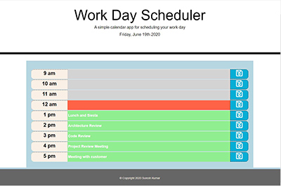

# dayPlanner

## Purpose

Create a JQuery powered Day Planner application that can help the user with scheduling work day schedule. This app will run in the browser and feature dynamically updated HTML and CSS powered by JQuery code. It will also feature a clean and polished user interface and be responsive, ensuring that it adapts to multiple screen sizes.

## Design

The dayPlanner has a single html page namely index.html. It has a static style sheet files viz., style.css. It has a javascript file called dp.js which mainly has JQuery libary code.

The html page is designed using bootstrap components so page is responsive to screen size changes and work well on all viewport sizes and devices. The pages are validated using java and js validation services and is free of errors and warnings.

The dp.js adds the dynamic behavior to the respective page. The dp.js is the main crux of the app. Itt dynamically makes appropriate moment.js API calls to obtain current day of the week and current date. The obtained day and date is displayed on the top of the page. It presents the user input boxes to plan current day's ( work day) hourly activity and a means to save the same. The typical workday work hours are assumed to be 9:00 am til 5:00 pm. The 1:00pm slot is planned as lunch hour by default. If the user wants to change it in the morning to a different hour he can do so by editing that input field with empty string or a different activity and save it. The user can individually schedule an activity for any hour and save the same. The saved activities get stored in localStorage.

The highlight of the app is:

1. It is specially designed to be used for a typical workday. Workday is Monday-Friday. Holidays and vacation days not handled.
2. However weekend day viz., Saturday and Sunday are handled differently and if the app is loaded on weekend day, the input field and save buttons will get disabled and no acticities can be entered or saved.
3. Current time and planned activity / activity slot are handled with following color coding
   a) a green background to all future hour slots / planned activities.
   b) a red background to current hour
   c) a grey background to past hour / past activities compared to current time.
4. Like in weekend days, the past hours and past hour activities cannot to be edited. The input fields and save buttons for past hours are disabled by app's design. It is a conscious design choice, as it is not prudent to allow user to edit older activities.
5. Another thought-out feature of the app is that though it will restore current Day's activities from local Storage on reload, the local Storage will get emptied any time the app is reloaded on a new day.So prior day's activities will not be shown the first time user starts to use the app in the morning.

### The code repository for this work can be found at:

[repository](https://github.com/s-suresh-kumar/dayPlanner)

### The hosted web page for this work can be found at:

[Deployed Application](https://s-suresh-kumar.github.io/dayPlanner/)

## Usage

Click on [Deployed Application](https://s-suresh-kumar.github.io/dayPlanner/) to launch JQuery powered dayPlanner app. Depending on when the app / page is loaded, the current day and current time is fetched from third party API (moment). The planned activities are displayed with past hours marked in grey and input field and Save button disabled. The current hour is marked red in background, which can be edited and saved. The future events / hour slots are shown in green background.

Though the weekends and past activities are disabled for editing, the app can easily be modified to make them editable and saveable for all 265 days. Also the app can be modified to have a different start and end hour for a typical work day.
